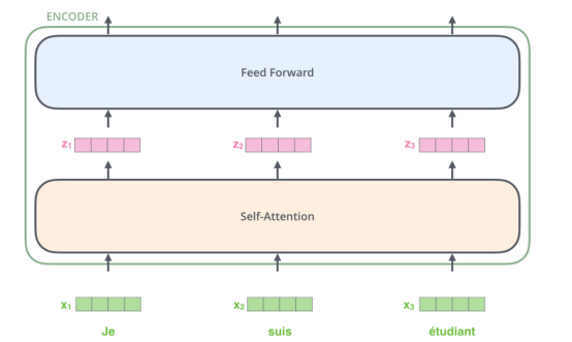

# Guba-emotion

Please cite our project when you use it.

Authors: Xutong Yue, Zhenkun Zhou (Capital University of Economics and Business)

如果使用该项目请引用。

作者：岳绪同，周振坤（首都经济贸易大学）

简介：基于pytorch的股吧金融情绪文本分类器，深度学习模型包括

- BiLSTM_attention；

- transformer；

- bert_base_chinese；

- bert_BiLSTM；

- electra；

- ERNIE（最优）。


### 环境

python3.9

pytorch

tqdm

scikit-learn


### 中文数据集介绍

在股吧评论文本中选取了11707条数据，并通过人工标记不同样本的情绪标签。一共5种标签，分别为愤怒，高兴，低落，恐惧，无情感，

每一种标签对应的样本量如下：

愤怒：2420条

高兴：2566条

低落：2716条

恐惧：1083条

无情感：2922条


### 模型效果

| 模型              | 四分类 | 五分类 |
| :---------------- | :----: | :----: |
| ERNIE_3.0_base    | 65.45% | 59.33% |
| Bert_base_bilstm  |  63%   | 54.31% |
| Bert_base_chinese | 56.40% | 57.10% |
| Electra           | 61.66% | 55.16% |
| Xlm_roberta_base  | 62.08% | 58.20% |


说明：五分类即针对上述五种情感标签，四分类是删除了无情感标签所对应数据，只包含其他四种情感标签


### 预训练模型

可以采用两种方式

1、 调用huggingface中模型，例如在运行时调用 python main.py –model_name=“bert_base_chinese”

2、 调用存储在本地的模型参数，包括：pytorch_model.bin，config.json，tokenizer.json，vocab.txt四个文件，然后在运行时指定模型存放路径

  

### 参数说明

见train.py中参数配置

 

### 使用说明：(以bert_base为例)

微调：

```
python train.py --model_name="bert_base_chinese"
```

使用范例：
```
from classify import pipe

print(pipe.SequenceClassification(['xxx']))
```
 

### ERNIE模型介绍

由Goolge提出的BERT自编码语言模型，通过设计两个下游任务（MLM，NSP），利用Transformer 的多层self-attention 双向建模能力可以提取词在句子中的关系特征，进而更全面的反映句子总体语义，相较于word2vec，能根据句子上下文获取词义，从而避免歧义出现。在很多nlp下游任务中展现出更好的效果。但是BERT模型主要关注字级别的语义信息，对一句话中每个字统一对待，随机mask，没有利用句子中的词法结构或语法结构。百度ERNIE 通过对训练数据中的词法结构，语法结构，语义信息进行统一建模，极大地增强了通用语义表示能力。

下图为ERNIE和bert的掩码策略对比：


ERNIE的内部结构是transformer的encoder部分，每个encoder之间不共享参数，ERNIE base主要包含：12 encoder layers, 768 hidden units, 12 attention heads。

模型的输入为开头是特殊字符[CLS]的一个序列，在每个encoder中通过self-attention，feed-word network得到一组新的表征在作为下一个encoder的输入，一般而言，设置每一个encoder输入为512维向量。下图为ERNIE一层encoder内部结构：



ERNIE1.0相较于bert改进了两种mask策略，一种是基于短语，另一种是基于实体的随机mask。ERNIE将多个字组成的短语作为mask对象，更有利于学习到句子中语法结构知识，提高泛化性；ERNIE2.0提出一个连续学习的与训练框架，主要思想是在预训练过程中可以顺序训练多个不同任务，使用上一个任务学习到的参数作为下一个任务的参数初始值，以便在学习过程中不断积累新的知识；ERNIE3.0用于语言理解和生成的大规模知识增强预训练模型。通过将大规模知识图谱的实体关系与大规模文本数据同时输入到预训练模型中进行联合掩码训练，促进了结构化知识和无结构文本之间的信息共享，大幅提升了模型对于知识的记忆和推理能力。注：本项目使用ERNIE3.0。
